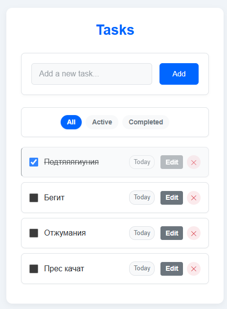
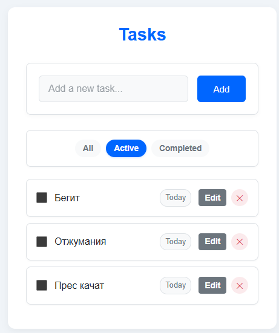
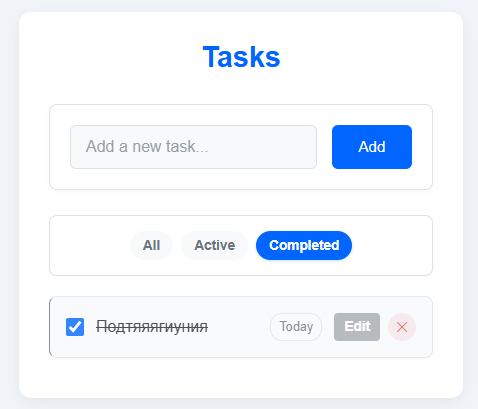

# Todo List Application

A simple, elegant, and functional Todo List application built with React, TypeScript, and Vite. This application allows you to manage your tasks with features like adding, editing, deleting, filtering, and sorting tasks.

## Screenshots

<div align="center">
  
  
  
</div>

## Features

- ✅ Add new tasks
- ✏️ Edit existing tasks
- 🗑️ Delete tasks
- ✓ Mark tasks as completed
- 🔍 Filter tasks (All, Active, Completed)
- 📅 View task creation date
- 💾 Persistent storage (tasks are saved in localStorage)
- 📱 Responsive design

## Technologies Used

- React 18
- TypeScript
- Vite
- SCSS for styling
- LocalStorage for data persistence

## Getting Started

### Prerequisites

- Node.js (v16 or higher)
- npm or yarn

### Installation

1. Clone the repository:
   ```
   git clone https://github.com/yourusername/todo-list.git
   cd todo-list
   ```

2. Install dependencies:
   ```
   npm install
   ```
   or
   ```
   yarn
   ```

3. Run the development server:
   ```
   npm run dev
   ```
   or
   ```
   yarn dev
   ```

4. Open your browser and navigate to `http://localhost:5173`

## Project Structure

```
todo-list/
├── public/
├── src/
│   ├── components/
│   │   ├── TodoList/
│   │   ├── TodoItem/
│   │   ├── TodoForm/
│   │   └── TodoFilters/
│   ├── types/
│   ├── App.tsx
│   └── main.tsx
├── package.json
└── README.md
```

## How It Works

- **TodoList**: Main component that manages the state and renders other components
- **TodoForm**: Allows adding new tasks
- **TodoItem**: Displays a single task with options to edit, delete, or mark as completed
- **TodoFilters**: Provides filtering options for tasks

## Local Storage

The application utilizes browser's localStorage to persist your tasks between sessions. All tasks and filter preferences are automatically saved when you:

- Add a new task
- Edit a task
- Delete a task
- Mark a task as completed
- Change filter settings

## Future Enhancements

- Task priorities
- Due dates
- Categories/tags for tasks
- Dark/light theme toggle
- User accounts with cloud sync

## License

This project is licensed under the MIT License - see the LICENSE file for details.

## Acknowledgments

- This project was bootstrapped with [Vite](https://vitejs.dev/).
- Built with [React](https://reactjs.org/) and [TypeScript](https://www.typescriptlang.org/).

---

## Vite Configuration Information

This project uses Vite as the build tool. For more information on customizing the configuration, please refer to the [Vite documentation](https://vitejs.dev/config/).
